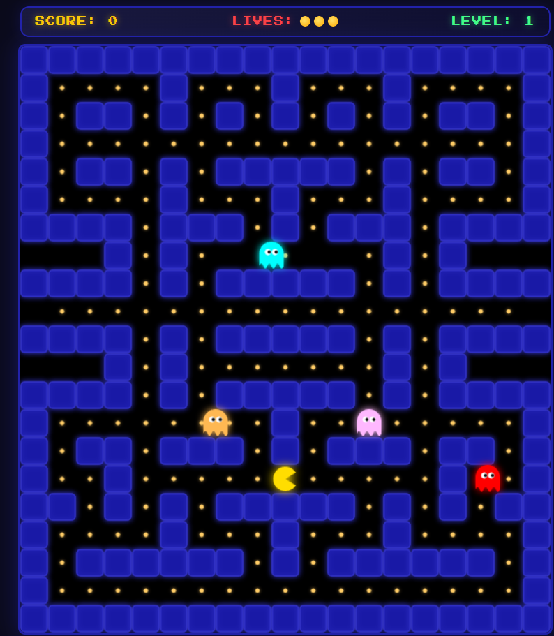

# Vanilla JS Pac-Man 🕹️

A fully playable clone of the classic arcade game Pac-Man, built entirely from scratch without any external game engines or libraries. This project demonstrates core game development concepts like game loops, collision detection, and procedural rendering.

## 🚀 Live Demo
[Play the game here!](https://anwishmcseug-dot.github.io/Pacman-JS/) 

## 📸 Preview


## ✨ Technical Highlights
* **Vanilla JavaScript:** All game logic, state management, and entity movement is handled with pure ES6+ JavaScript.
* **HTML5 Canvas Rendering:** Graphics are drawn procedurally using the Canvas API (`ctx.arc`, `ctx.fillRect`, etc.) rather than relying on static image sprites.
* **AABB Collision Detection:** Implemented Axis-Aligned Bounding Box math to handle smooth interactions between Pac-Man, the maze walls, and the ghosts.
* **Custom Pathfinding:** Ghosts utilize a randomized pursuit algorithm to navigate intersections and chase the player.
* **Custom Ghost "AI":** Ghosts utilize a randomized pathfinding algorithm with Fisher-Yates shuffling to navigate intersections and relentlessly pursue the player.
* **State Management:** Manages complex game states including score, lives, levels, and a temporary "Scared Mode" triggered by power pellets.
* **Optimized Game Loop:** Runs on a consistent `requestAnimationFrame` / `setTimeout` loop locked to a stable frame rate for smooth gameplay.

## 🛠️ Tech Stack
* **HTML5** (Canvas)
* **CSS3**
* **JavaScript** 
## 💻 How to Run Locally
Since this project uses vanilla web technologies, no build tools (like npm or Webpack) are required.

1. Clone the repository:
   ```bash
   git clone [https://github.com/anwishmcseug-dot/Pacman-JS.git](https://github.com/anwishmcseug-dot/Pacman-JS.git)